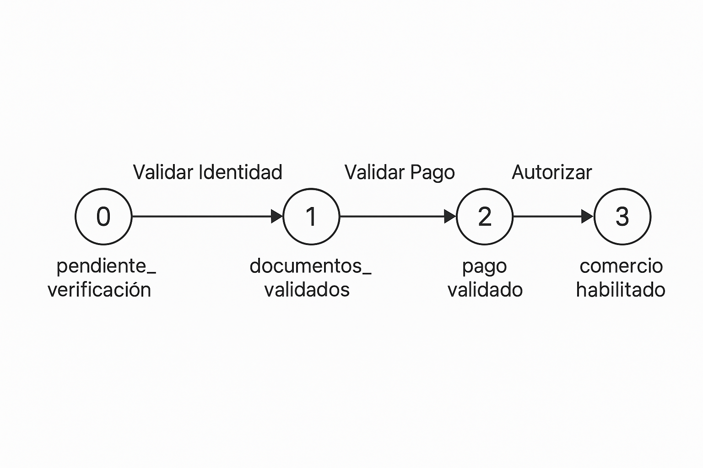

# Configuración del Entorno

Para establecer el entorno de ejecución en Rails, usa:

```bash
export RAILS_ENV=development   # Modo desarrollo
export RAILS_ENV=test          # Modo pruebas
export RAILS_ENV=production    # Modo producción
```
---

# Migración de Datos desde SEPREC

```bash
bundle exec rake crawl:info
```

<u>Nota.-</u> 
1. Para configurar la migración editar el archivo: 

```bash
cat ./backend/info_be/config/crawl_info.yml
```

2. El log de la migración de SEPREC está en el archivo:

```bash
tail ./backend/info_be/log/crawl_info.log
```
---

# Generación de Sitemaps

```bash
bundle exec rake sitemap:generate
```

`GeneradorSitemap` es un servicio que crea archivos XML para cada ciudad, estructurados según el estándar [Sitemaps.org](https://www.sitemaps.org/protocol.html), facilitando así la indexación por motores de búsqueda como Google.

### ¿Qué hace este comando?

1. Crea un sitemap por ciudad con más de 100 comercios activos.
2. Incluye URLs para:
   - Cada ciudad.
   - Cada zona dentro de la ciudad.
   - Cada comercio que:
     - Tiene email.
     - No es persona natural o ha autorizado su publicación.
3. Ordena los comercios de forma descendente por `id`, priorizando los más recientes.

Este comando crea archivos `.xml` en el directorio `public/sitemaps/`, uno por ciudad, listando las URLs que deben ser indexadas.

```bash
export RAILS_ENV=development
bundle exec rake sitemap:generate
```
---

# ZonificarComercios

Desde RAILS console

```ruby
ZonificarComercios.ejecutar(ID_CIUDAD)
```

### Parámetro
- **`ID_CIUDAD`** (*Integer*): El identificador único de la ciudad que se desea procesar. Este ID corresponde al registro de la ciudad en la base de datos.


## Descripción
`ZonificarComercios` es un servicio que permite básicamente 2 cosas procesar y actualizar las zonas de los comercios por su descripción y actualzia la información geoespacial de los comercios en una ciudad. Su función principal es identificar y zonificar los comercios según sus coordenadas geográficas, creando polígonos de las zonas a partir de las coordenadas de los comercios que tienen como descripción la misma zona, estos polígonosrepresentan las diferentes zonas dentro de una ciudad, el algoritmo que se utiliza es envolvente convexa (convex hull). En esta etapa se utiliza la descripción de la zona para clasificar los comercios en la interfaz y se graba en oracle una geometría que en el futuro puede servir para hacer consultas de comercios por aproximación geográfica.


## ¿Qué Hace Este Comando?
1. **Inicio del Proceso:** Inicia la zonificación para la ciudad indicada por `ID_CIUDAD`.
2. **Obtención de Zonas Elegibles:** Filtra y agrupa los comercios que cumplen con ciertos criterios (como cantidad mínima de registros y coordenadas válidas).
3. **Generación de Polígonos:** Calcula polígonos geoespaciales para cada zona elegible basándose en las coordenadas de los comercios.
4. **Actualización de la Base de Datos:** Inserta o actualiza los registros de las zonas en la tabla `zonas_shape`.
5. **Asignación de Zona a Comercios:** Asocia cada comercio con la zona correspondiente basándose en coincidencias de texto y relaciones espaciales.
6. **Actualización de Totales:** Calcula y actualiza el número total de comercios por zona y por ciudad.
7. **Verificación:** Confirma que los datos en `zonas_shape` se hayan actualizado correctamente.

## Logs
El proceso generará logs informativos que podrás consultar para verificar el estado de la ejecución:

- **Inicio de la zonificación:** Indica cuándo comienza el proceso.
- **Zonas encontradas:** Lista las zonas procesadas.
- **Errores:** Cualquier problema encontrado durante la ejecución.

---

# Iniciar Servidor de Sidekiq en Desarrollo

Primer shell
```bash
redis-server
```

Segundo Shell
```bash
bundle exec sidekiq
```

Tercer Shell
```bash
rails server
```

http://localhost:3000/sidekiq

---
# Ciclo de Vida de una Solicitud en Infomóvil

Las solicitudes en Infomóvil transitan por un conjunto de estados definidos, pero lo más relevante es comprender las **transiciones** entre estos estados, ya que implican acciones concretas a través de endpoints y cambios en los datos tanto de la solicitud como del comercio.

---

## Transiciones y Acciones

Las transiciones entre estados no son automáticas, sino que se activan mediante acciones explícitas que afectan tanto a la solicitud como al comercio. Estas acciones se ejecutan a través de endpoints definidos en el backend:

### 1. Transición de `pendiente_verificacion` a `documentos_validados` — **Validar Identidad**

- Endpoints involucrados:
  - `POST /api/documentos/ci`
  - `POST /api/documentos/nit`

- Acciones:
  - Se cargan y validan los documentos NIT y CI.
  - Si el NIT es válido:
    - Se extrae la Razón Social, el Repreentante y el NIT
    - Se graba en nombre al representante
    - Se graba `solicitud.nit_ok = true`.
  - Si el CI es válido:
    - Se extrae el nombre y se compara `solicitud.nombre`.
    - Se actualiza `comercio.contacto` con el nombre extraído.
    - Se marca `solicitud.ci_ok = true`.
    - Se actualiza `comercio.email_verificado`.
  - Una vez ambos están correctamente validados:
    - Se marca `comercio.documentos_validados = true`.
    - Se cambia `solicitud.estado = 1` (`documentos_validados`).

### 2. Transición de `documentos_validados` a `pago_validado` — **Validar Pago**

- Endpoint: `POST /api/documentos/comprobante`

- Acciones:
  - Se verifica el comprobante de pago.
  - Se valida que el número de cuenta destino sea correcto.
  - Si es válido:
    - Se marca `solicitud.pago_validado = 2`.
    - Se cambia `solicitud.estado = 2` (`pago_validado`).
    - Se actualiza `solicitud.fecha_fin_servicio`.

### 3. Transición de `pago_validado` a `comercio_habilitado` — **Autorizar**

- Endpoints involucrados:
  - `PATCH /api/solicitudes/:id`
  - `PATCH /api/comercios/:id`

- Proceso:
  - Se actualiza manualmente `solicitud.estado = 3` (`comercio_habilitado`).
  - Se actualiza `comercio.autorizado = true`.
  - Se marca la fecha de inicio de habilitación del comercio.
  - A partir de este momento, el comercio queda visible públicamente durante **un año**.

---

## Excepciones del flujo

### Comercios no SEPREC
Para comercios registrados manualmente (no provenientes del padrón oficial SEPREC), **se omite la verificación de identidad**. Estas solicitudes comienzan directamente en el estado `documentos_validados` (`estado = 1`), sin pasar por la carga de CI o NIT.

### Solicitudes gratuitas
En el caso de solicitudes sujetas a convenios, promociones u otros criterios para exoneración de pago, **se omite la validación del comprobante**. Estas solicitudes pueden pasar directamente de `documentos_validados` a `comercio_habilitado`.

---

## Estado `rechazada`
En cualquier punto del proceso, si la solicitud no cumple con los requisitos mínimos o la documentación es inválida, puede ser marcada como `rechazada` (`estado = 5`). En ese caso, el proceso se detiene y será necesario crear una nueva solicitud para reiniciar el flujo.
